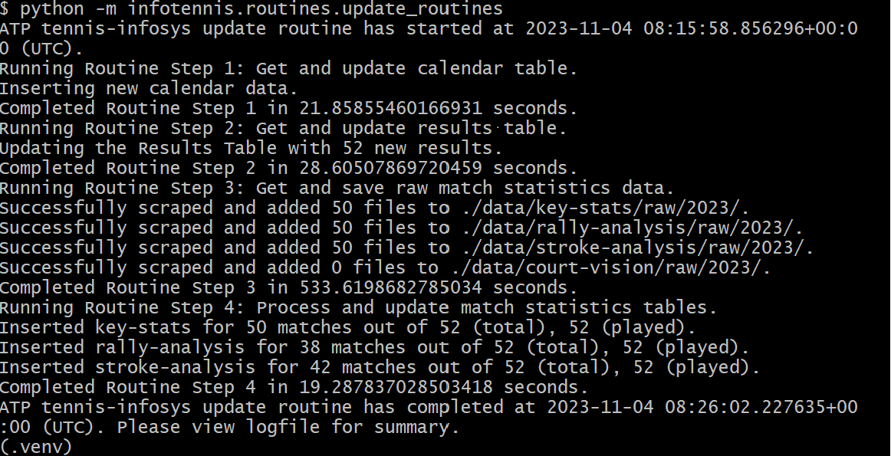

# Infotennis

## Overview

This repository contains Python scripts for scraping and processing data from the ATP Tour website (a.o. Nov 2023)

6 data types are currently supported from the ATP website:
- Tournament Calendar
- Tournament Results
- Match Stats

And if available:
- Rally Analysis
- Stroke Analysis
- Court Vision

## Installation

Clone this repository to your local machine and install with pip.

```
$ git clone https://github.com/glad94/infotennis
$ cd infotennis
$ pip install .
```

## Quick Start
Scrape the key stats from 1 ATP match and display the output.
``` python
from infotennis.scrapers.scrape_match_data import scrape_ATP_match_data
scrape_ATP_match_data(2023, 352, "ms005", "key-stats")
```

```
{'courtId': 1,
 'matchCompleted': True,
 'isDoubles': False,
 'setsCompleted': 3,
 'players': [{'seed': '13',
   'player1Name': 'A. DE MINAUR',
   'player1Id': 'DH58',
   'player1Country': 'AUS'},
  {'seed': '5',
   'player1Name': 'A. RUBLEV',
   'player1Id': 'RE44',
   'player1Country': 'RUS'}],
 'setStats': {'set0': [{'order': 1,
    'name': 'Serve Rating',
    'player1': '229',
    'player2': '270',
    'player1Bar': 46,
    'player2Bar': 54,
    'influence': '0%',
    'player1Points': [],
    'player2Points': []},
   {'order': 2,
    'name': 'Aces',
    'player1': '5',
    'player2': '4',
...
    'influence': '0%',
    'player1Points': [],
    'player2Points': []}],
  'set4': [],
  'set5': []}}
```

Process the raw data.
``` python
from infotennis.processing.processing_keystats import process_key_stats
process_key_stats(2023, 352, "ms005", "Quarter-Final", raw_data)

```

```
	year	tournament_id	match_id	round	sets_completed	set_n	player_id	opponent_id	serve_rating	aces	...	unforced_errors	service_points_won	service_points_won_pct	return_points_won	return_points_won_pct	total_points_won	total_points_won_pct	max_speed	serve1_avg_speed	serve2_avg_speed
0	2023	352	ms005	Quarter-Final	3	0	DH58	RE44	229	5	...	13	53/96	55.2	27/79	34.2	80/175	45.7	207	192	154
1	2023	352	ms005	Quarter-Final	3	0	RE44	DH58	270	4	...	13	52/79	65.8	43/96	44.8	95/175	54.3	213	195	147
0	2023	352	ms005	Quarter-Final	3	1	DH58	RE44	293	1	...	3	24/37	64.9	10/29	34.5	34/66	51.5	207	197	158
1	2023	352	ms005	Quarter-Final	3	1	RE44	DH58	252	1	...	7	19/29	65.5	13/37	35.1	32/66	48.5	213	198	147
0	2023	352	ms005	Quarter-Final	3	2	DH58	RE44	219	0	...	5	15/28	53.6	15/36	41.7	30/64	46.9	205	191	153
1	2023	352	ms005	Quarter-Final	3	2	RE44	DH58	252	1	...	5	21/36	58.3	13/28	46.4	34/64	53.1	213	193	146
0	2023	352	ms005	Quarter-Final	3	3	DH58	RE44	164	4	...	5	14/31	45.2	2/14	14.3	16/45	35.6	206	183	152
1	2023	352	ms005	Quarter-Final	3	3	RE44	DH58	352	2	...	1	12/14	85.7	17/31	54.8	29/45	64.4	208	196	152

```

## Local Data Pipeline
This repository also contains scripts that can run a full data scraping and processing pipeline on your local machine. This pipeline retrieves and updates data to a MySQL database through the `pymysql` client library, but it is also possible to modify the source code to omit the database dependencies. 

### Setting up the database tables
Assuming you have installed MySQL and created a database for this called `my_database`,

1. Create a `.env` file in this project's root directory with the 2 environment variables:
```shell
DATABASE_NAME = "my_database"
DATABASE_PASSWORD =  "<your-database-password>"
``` 

2. Create a venv in this project if you haven't already. 
```unix
$ python -m venv .venv (or a path of your choice)
```

3. Activate the venv and run `init_tables.py`
```unix
$ source .venv/Scripts/activate.bat (Windows) or source .venv/bin/activate (POSIX)
$ python -m infotennis.routines.init_tables
```
This should create 6 tables, `atp_results`, `atp_calendars`, `atp_key_stats`, `atp_rally_analysis`, `atp_stroke_analysis`, `atp_court_vision` in your database. 

### Running the data pipeline 
4. Simply run `update_routines.py` to begin the entire data pipeline.
```unix
$ python -m infotennis.routines.update_routines
```

This pipeline follows a sequence of 4 processes: 

- (1) The script retrieves the [ATP tournament calendar](https://www.atptour.com/en/scores/results-archive) for the current year, compares it against the `atp_calendars` table in the database to obtain a dataframe of tournaments containing updated results, and updates `atp_calendars`. 

- (2) From this dataframe of tournaments containing updated results, the results from each tournament are scraped from their respective [ATP results page](https://www.atptour.com/en/scores/archive/cincinnati/422/2023/results) and used to update `atp_results`. A dataframe of all added ATP results is also returned.


- (3) The pipeline will attempt to retrieve, decode and save the raw data for 4 data types (`key-stats`, `rally-analysis`, `stroke-analysis`, `court-vision`) for every result in the dataframe returned in step 2. These raw data files will be saved as JSON files in `data/` by default (you can set the output dir to your own choice in `config.yaml`).

- (4) The raw data is then processed and uploaded into their respective database tables. You can view the examples in `notebooks/` for a glance of processed data structures.

A successful run of the pipeline should print something like below in your terminal:



**Warning:** Running this pipeline right off-the-shelf will be pretty time-consuming (mainly due to steps (3) and (4)) due to the large amount of match data to collect at the start (at the time of writing, there are over 2000 matches from 2023). Also, note that step (1) will only get calendar data for the current year, i.e. you wouldn't be able to run this to initialise your database with data from previous years like 2022.  


### Limitations
The results pages from team tournaments (ATP/United/Laver Cup) are currently not supported in step (2), hence match data from these tournaments won't be retrieved via this pipeline. You can still try to obtain them manually via the standalone scraper functions. 

## More data?
The scraping of Match Stats Data (e.g. key-stats) relies on retrieving data from their Infosys API, which also exists in similar format for the Australian Open and Roland Garros, at least from 2020 onwards. You may refer to my other repository for some [examples in the notebooks](https://github.com/glad94/tennis-web-scraping/blob/main/notebooks/02AO_AO_Court-Vision-Raw_Scraper.ipynb).

## Feedback
I have not tested this project beyond my own local machine, so any feedback about bugs, code efficiencies or bad practices are most welcome. Please feel free to raise an issue or to reach out via lgjg1994@gmail.com or [@dlareg49](https://twitter.com/dlareg49) on Twitter.
